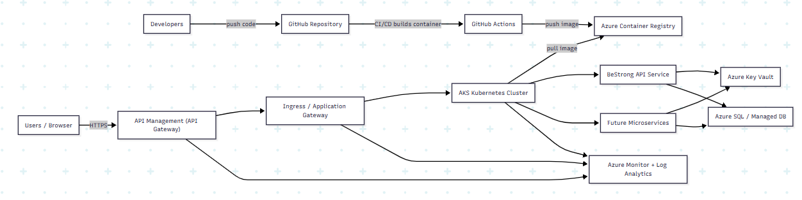

# BeStrong — Azure Infrastructure with Terraform + GitHub Actions CI/CD

Цей репозиторій містить Terraform-код для розгортання базової Azure-інфраструктури стартапу **BeStrong** та CI/CD пайплайн (GitHub Actions), який автоматизує перевірку і деплой інфраструктури за trunk-based підходом.

---

## Архітектура (коротко)

Інфраструктура побудована як приватне середовище в Azure з керованими сервісами (без VM):

- **Azure App Service for Containers** — запуск .NET бекенду в контейнері (managed сервіс).  
  Використовується **User Assigned Managed Identity** для доступу до інших ресурсів без паролів.
- **Application Insights + Log Analytics Workspace** — централізовані логи/метрики/діагностика для додатку.
- **Azure Container Registry (ACR)** — приватний реєстр Docker-образів. Доступ на pull надається лише застосунку (через роль `AcrPull` для Managed Identity). Повністю приватний з Private Endpoint.
- **Azure Key Vault** — зберігання секретів (паролі/токени). Доступ дозволений тільки для Managed Identity застосунку. SQL пароль зберігається в Key Vault і підтягується через Key Vault References.
- **Virtual Network + Subnets** — "приватна територія" (ізоляція ресурсів у VNet):
  - Subnet для VNet Integration (App Service)
  - Subnet для Private Endpoints
- **Azure SQL Database (SQL Server compatible)** — реляційна база даних для транзакційних даних. Повністю приватна з Private Endpoint.
- **Azure Storage + Azure Files Share** — сховище для файлів користувачів, змонтоване до App Service як папка. Повністю приватне з Private Endpoint.
- **Private DNS Zones** — DNS резолюція для всіх приватних ендпоінтів (ACR, Key Vault, SQL, Storage, App Service).
- **Terraform remote state** — state зберігається в Azure Storage (не локально).

---

## Структура репозиторію

- `bootstrape-state/` — створює ресурси для remote backend Terraform (Storage Account + container для tfstate).
- `infra/` — основна інфраструктура BeStrong (мережа, App Service, ACR, Key Vault, SQL, storage, monitoring тощо).
- `.github/workflows/` — GitHub Actions workflows (YAML) для CI/CD:
  - `terraform-apply.yml` — Docker build + push + Terraform deploy при push в master
  - `terraform-pr.yml` — Docker build + Terraform validate/plan для Pull Requests
- `DotNet-8-Crud-Web-API-Example/` — .NET 8 CRUD Web API застосунок
- `Dockerfile` — multi-stage Docker образ з EF migrations bundle
- `docker-compose.yml` — локальне тестування
- `entrypoint.sh` — запуск міграцій при старті контейнера

---

## Remote State (Terraform Backend)

Terraform state зберігається в Azure Storage (remote backend).  
Спочатку створюється backend через `bootstrap-state/`, а далі основна інфраструктура в `infra/` використовує цей backend у `backend.tf`.

---

## CI/CD (GitHub Actions, Trunk Based)

Використано trunk-based flow:
- основна гілка: **`master`**
- робота через короткі гілки `feature/*` → Pull Request → merge в `master`

### Pull Request workflow (`terraform-pr.yml`):
- Docker build + smoke test (перевірка що контейнер стартує)
- `terraform fmt -check` → `terraform init` → `terraform validate` → `terraform plan`

### Main branch workflow (`terraform-apply.yml`):
- Docker build + push до ACR з тегом з Git SHA
- `terraform init` → `terraform validate` → `terraform apply` (з новим образом)

Workflows використовують GitHub-hosted runners (ubuntu-latest).

---

## Параметри/секрети

Чутливі значення не зберігаються в коді. Використано GitHub Secrets:

**Azure credentials:**
- `ARM_CLIENT_ID`, `ARM_CLIENT_SECRET`, `ARM_TENANT_ID`, `ARM_SUBSCRIPTION_ID` — Service Principal для Terraform
- `ACR_LOGIN_SERVER`, `ACR_USERNAME`, `ACR_PASSWORD` — для Docker push до ACR

**Terraform variables:**
- `TF_VAR_prefix` — префікс для ресурсів
- `TF_VAR_location` — Azure region
- `TF_VAR_sql_admin_password` — SQL пароль (зберігається в Key Vault, підтягується через Key Vault Reference)
- `TF_VAR_container_image` — передається автоматично з build job

---

## Демонстрація (відео)

▶️ Відео з демонстрацією роботи Terraform та CI/CD:  
https://drive.google.com/drive/folders/1Nlk66kXhcFD204rej84FNiBFT9DJ4y09?usp=sharing

> Примітка: посилання буде замінено на фінальне після завантаження відео.

---

## Автор

Sofiia Kosar


# BeStrong API: Local Minikube Deployment & Future Azure Cloud Architecture Report

## 1) Executive Summary
BeStrong is beginning product development and needs a reliable way to run and demonstrate its backend API consistently across machines and later in the cloud.

We packaged the .NET API into a Docker container and deployed it to a local Kubernetes environment using Minikube. This provides a realistic, production-like environment for testing and demonstrations without cloud costs.

I also designed a future-ready Azure architecture that supports a microservice approach: services can be deployed independently, scaled based on demand, and operated securely with monitoring and controlled access.

---

## 2) What Was Delivered (Local Demo Environment)

### 2.1 Containerized BeStrong API
The backend API is packaged as a Docker image.

This ensures the application behaves the same on any computer that runs Docker.

**Business value:** Less time debugging environment differences; faster onboarding for new team members.

### 2.2 Deployed to Kubernetes Locally (Minikube)
The API runs inside Minikube, a lightweight local Kubernetes cluster.

The service is exposed so it can be accessed from a local browser.

**Business value:** Demonstrations and testing happen in a setup similar to a real production platform.

### 2.3 How to Access the API (Example)
Once started, the API can be opened in a browser:

- `.../api/movies` (example endpoint)
- `.../swagger/index.html` (API documentation UI, if enabled for demo)

---

## 3) Why This Solution Was Chosen (Business-Focused)

### 3.1 Why Docker (Containerization)
**Problem it solves:** “It works on my machine” issues and unpredictable deployments.

**Benefits for business:**
- **Consistency:** the same package runs everywhere.
- **Speed:** faster deployments and simpler rollback to previous versions.
- **Lower risk:** fewer production incidents caused by mismatched libraries/configurations.

### 3.2 Why Kubernetes (Even for Local)
**Problem it solves:** scaling and reliability become difficult as the system grows.

**Benefits for business:**
- **Scalability:** when demand grows, services can be scaled up without rewriting the app.
- **Resilience:** if something crashes, Kubernetes can restart it automatically.
- **Future readiness:** the same deployment model can later run in Azure (AKS) with minimal changes.

### 3.3 Why Minikube for Local Demo
**Problem it solves:** cloud environments cost money and require more setup for quick demos.

**Benefits for business:**
- **Zero cloud cost** for development demos and early testing.
- **Fast feedback** for the team (deploy/test in minutes).
- **Production-like environment** without needing Azure for every experiment.

---

## 4) Local Deployment Overview (High Level)
The local setup follows a simple flow:

1. Build a Docker image of the API
2. Load the image into Minikube
3. Start the API using Kubernetes deployment
4. Expose it to the browser via a Kubernetes service

This approach makes the demo reproducible and easy to repeat.

---

## 5) Future Azure Cloud Architecture (Microservice-Ready)

### 5.1 Business Requirements Addressed
As BeStrong evolves, the platform should support:
- **Growth:** add new services without redesigning everything
- **Scaling:** increase capacity during peak usage
- **Reliability:** avoid downtime through multiple instances and health checks
- **Security:** protect data and restrict internal access
- **Operational visibility:** logs/metrics to reduce troubleshooting time
- **Cost control:** scale only what is needed

### 5.2 Proposed Azure Components (Plain Explanation)
- **AKS (Azure Kubernetes Service):** Runs the microservices reliably and scales them.
- **ACR (Azure Container Registry):** Stores container images securely.
- **API Gateway (Azure API Management):** A “front door” for APIs:
  - controls access (authentication),
  - supports versioning,
  - rate limiting (protects from abuse),
  - consistent endpoints for clients.
- **Ingress / Application Gateway:** Handles web traffic routing and HTTPS certificates.
- **Key Vault:** Secure storage for secrets (passwords, keys).
- **Managed Database (Azure SQL / other):** Reliable data storage with backups.
- **Monitoring (Azure Monitor + Log Analytics):** Visibility into performance and failures.
- **Networking (VNet + Private Endpoints):** Restricts sensitive components to private access.

---

## 6) Security & Operational Notes (Client-Friendly)
- **Private data stays private:** Key Vault and databases should be accessible only inside the Azure network (private endpoints).
- **Controlled public entry:** only the gateway/ingress is exposed publicly.
- **Monitoring & alerts:** support team receives alerts early, reducing downtime.

---

## 7) Conclusion
This solution provides:
- A fast, low-cost local Kubernetes demo environment (Minikube)
- A clear migration path to a secure, scalable Azure microservice platform (AKS + ACR + APIM + Key Vault + Monitoring)


It supports BeStrong’s business needs today (quick demos, consistent deployments) and tomorrow (growth, reliability, and security in the cloud).


## 1. Executive Summary

To evaluate a NoSQL option for the BeStrong platform, we implemented a MongoDB Proof of Concept on a local Kubernetes cluster using Minikube.  
This PoC proves three key requirements:

1) **Security**: MongoDB requires a username and password  
2) **Data modeling readiness**: a `BeStrong` collection was created and populated  
3) **Reliability**: data remains available after the MongoDB container (pod) is restarted thanks to persistent storage

This approach is aligned with future cloud deployment patterns and can be migrated to Microsoft Azure with minimal conceptual change.

---

## 2. What Was Implemented

### 2.1 MongoDB in Kubernetes (Minikube)
MongoDB is deployed inside Minikube (local Kubernetes). Kubernetes is the same class of platform commonly used in cloud production environments, which makes the PoC realistic and future-ready.

### 2.2 Authentication (Login & Password)
MongoDB access is protected by credentials (username/password). This prevents anonymous access and is a baseline security requirement for business systems.

### 2.3 “BeStrong” Collection
A MongoDB collection named `BeStrong` was created (MongoDB creates collections automatically when inserting the first document). A demo record was inserted to confirm read/write operations.

### 2.4 Persistence (No Data Loss After Restart)
MongoDB is configured with persistent storage via a Kubernetes **Persistent Volume Claim (PVC)**.  
Because containers are ephemeral by nature, persistence ensures that data is not lost when the MongoDB pod is restarted, upgraded, or rescheduled.

---

## 3. Why This Solution Was Chosen (Business-Focused)

### Why MongoDB (NoSQL)
- **Flexibility during early development:** document-based storage supports frequent requirement changes without heavy schema migrations.
- **Fast iteration:** teams can adjust data structures quickly during the PoC/early product stage.

### Why Kubernetes for PoC (Minikube)
- **Production-like behavior:** Kubernetes recreates real conditions like container restarts, health behavior, and persistent volumes.
- **Cloud-ready:** the same operational model can later be used in Azure (AKS).

### Why Persistence (PVC)
- **Business continuity:** data must not disappear due to a container restart.
- **Operational reliability:** supports upgrade/restart scenarios with minimal risk.

### Why MongoDB is not publicly exposed
- **Security best practice:** databases should stay private.
- For demo access, we use a temporary local tunnel (port-forward), not a public endpoint.

---

## 4. Demo Verification (Commands & Expected Results)

> The following commands demonstrate that the system meets PoC requirements.

### 4.1 Check MongoDB Pod, Service, and Persistence
```bash
kubectl get pods -n bestrong
kubectl get svc -n bestrong
kubectl get pvc -n bestrong